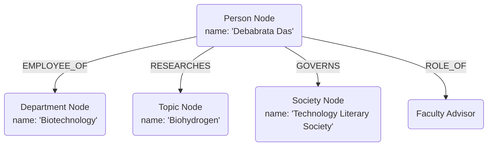

# Future Improvements: Transitioning to a Semantic Knowledge Graph

This document details the architectural proposal to migrate **GraphMind** from a document-level page graph to a **Semantic Knowledge Graph (Entity-Relationship Graph)**. 

---

## 1. The Core Limitation of the Current Document Graph
Currently, GraphMind uses a **Document Graph** where:
* Nodes are entire pages: `(:Page {url: "...", content: "..."})`
* Edges are raw hyperlinks: `()-[:LINKS_TO]->()` or `()-[:SEMANTICALLY_RELATED]->()`

### Consequences:
1. **High Latency & Token Usage**: To resolve simple facts, the agent must load full page content strings (up to 15,000 characters per hop) and feed them to the LLM.
2. **Logic & Source Rejections**: The Mixture of Experts (MoE) verifier checks raw text claims, which can easily trigger rejections due to minor phrasing differences (e.g. interpreting "faculty profile" as "faculty advisor").
3. **Graph Sparsity**: The agent relies on physical hyperlinks (`LINKS_TO`), which are sparsely distributed across the wiki, leading to dead ends.

---

## 2. Proposed Semantic Knowledge Graph Architecture
Instead of storing pages, we extract and represent real-world entities and their typed semantic relationships.



### Proposed Node Types:
* `(:Person {name, joined_year, profile_url})`
* `(:Department {name, code})`
* `(:Society {name, type})`
* `(:Course {code, name, credits})`
* `(:ResearchTopic {name})`

### Proposed Relationship (Edge) Types:
* `()-[:EMPLOYEE_OF]->()`
* `()-[:GOVERNS]->()`
* `()-[:RESEARCHES]->()`
* `()-[:OFFERED_BY]->()`
* `()-[:FACULTY_ADVISOR_OF]->()`

---

## 3. Implementation Strategies

### Strategy A: Rule-Based & Regex Parsing (Fast Bootstrapping)
Since wikitext contains templated structures (such as Infoboxes and standard tables), we can write python regex patterns to parse and extract relationships instantly (under 10 seconds for the entire database).
* **Faculty Extraction Rule**: Parse lines containing `Department: [Name]` and `Research Area(s): [Topics]`.
* **Society Extraction Rule**: Parse lines containing `Governors: [Names]`.

### Strategy B: LLM-Based Information Extraction (Comprehensive)
Run a lightweight background task where an LLM parses each wikitext document and outputs structured JSON containing entities and relationships (triples).
* *Pros*: Captures complex relationships buried in narrative paragraphs.
* *Cons*: Takes ~2 hours to process all 3,585 pages.

---

## 4. Query Execution Upgrade (Hybrid Retrieval)
Once the semantic graph is built, we can transition to a **Hybrid Graph RAG** query pipeline:

```
[User Query] ──> [LLM translation to Cypher] ──> [Neo4j direct pathfind] ──> [LLM response formatting]
```

1. **Step 1**: The LLM translates a natural language question (e.g., *"Who governs the TLS?"*) into a Cypher query.
2. **Step 2**: Neo4j executes the path traversal in memory (**without LLM calls**), returning the exact names in milliseconds.
3. **Step 3**: The LLM receives the database output and formats the final sentence for the user.

---

## 5. Remote Administrative Data Ingestion Portal

For future iterations, we can implement a secure, remote administrative portal to upload and process updated datasets without needing direct server shell access.

### Proposed Architecture:
* **Admin Web UI / REST Endpoint**: Add a password-protected route `/admin/ingest` on the FastAPI server that accepts multipart file uploads.
* **Authentication**: Integrate API token headers (`X-Admin-Token`) or Google Admin Group authorization.
* **Asynchronous Execution**: The file is stored in a temporary directory on the server, and a background task runs the ingestion incrementally without blocking incoming client requests.
* **Security Concerns**: Requires strict file size limit validation (e.g., maximum 50MB), strict parsing validation to prevent injection attacks, and rate limiting to prevent Denial of Service (DoS) attacks.

