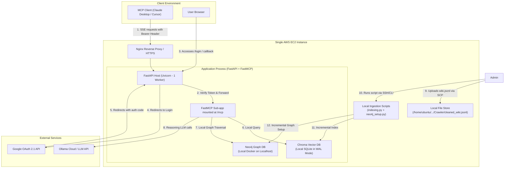

# 🧠 Consolidated GraphMind Remote MCP Server Migration Plan (MVP Working Prototype)

This plan outlines the architecture, security, and manual deployment steps to run the **GraphMind (RAG + GoT + MoE)** system as a secure, remote **Model Context Protocol (MCP)** server on a single **AWS EC2 instance** using FastAPI, FastMCP, and Google OAuth 2.1.

---

## 🏛️ 1. Architecture Overview

To minimize cost and infrastructure complexity, all database and application services reside on a single **AWS EC2 instance** (Ubuntu `t3.medium` or `t3.large`). No external AWS services (no Cognito, RDS, DynamoDB, or S3) are used for primary serving.




---

## 💾 2. Existing Embeddings Migration (Local Copy & WAL Mode)

No embeddings need to be re-computed. The local ChromaDB instance consists of a SQLite database and index files stored in the `VectorStore/` folder. We migrate this database directly to the server:

1. **Complete Copy**: To prevent database and search index corruption, the entire local `VectorStore/` directory (including HNSW segment subdirectories) must be copied via SCP.
2. **Write-Ahead Logging (WAL)**: To allow concurrent reads from MCP users while offline administration scripts perform updates, we force SQLite into WAL mode on the server.
3. **Write Isolation**: The FastAPI/FastMCP application accesses ChromaDB in **read-only** mode. Only the offline ingestion script writes to ChromaDB. This eliminates SQLite write-lock contention across uvicorn processes.

---

## ⚙️ 3. Administrative Data Ingestion (Local Executables Only)

To eliminate web vulnerability vectors (e.g., authenticated upload exploits), there is **no public file upload endpoint**. Data ingestion is triggered only by an administrator logged into the EC2 instance via SSH.

### Ingestion Workflow:
1. **Upload**: The administrator copies the updated wiki file using SCP to `/home/ubuntu/RAG_and_MCP_examples/Crawler/cleaned_wiki.jsonl`.
2. **Execution**: The administrator runs the ingestion scripts using the virtual environment's python executor to ensure all dependency packages are resolved:
   ```bash
   /home/ubuntu/RAG_and_MCP_examples/venv/bin/python RAG/indexing.py
   /home/ubuntu/RAG_and_MCP_examples/venv/bin/python neo4j/neo4j_setup.py
   ```
3. **Idempotency & Hardware Auto-Detection**:
   - The indexing script checks previously indexed URLs in ChromaDB and skips unchanged entries.
   - The script auto-detects system hardware (CPU or GPU) to prevent PyTorch crash loops on CPU-only instances.
4. **Status Verification**: The administrator can run a test query on Neo4j or use the local reasoning engine CLI run to verify the newly ingested data.

---

## 🔐 4. Google OAuth 2.1 & Static API Key Fallback

Since headless MCP clients (like Cursor or Claude Desktop) cannot handle interactive browser redirects or OAuth callback cycles in real time:

1. **Browser Login**: The developer navigates to the public server URL in their browser (`https://your-domain.com/login`), signs in with Google, and is redirected to `/callback`.
2. **Token Copy**: The callback page displays a copy-pasteable JSON configuration block containing the short-lived JWT token.
3. **Client Configuration**: The developer adds the JWT token as an HTTP header in their local `claude_desktop_config.json` or Cursor settings:
   ```json
   "headers": {
     "Authorization": "Bearer <your_google_jwt_token>"
   }
   ```
4. **Static API Key Fallback**: The server supports a static token (`GRAPHMIND_API_KEY`) defined in the `.env` file, allowing developers to connect immediately without browser authentication.

---

## 🛠️ 5. Production-Ready Backend Implementation (`mcp_server.py`)

This is the complete, high-performance `mcp_server.py` implementation incorporating asynchronous JWT verification, hardware auto-detection, static API keys, and dual-transport execution (stdio + SSE):

```python
import os
import sys
from dotenv import load_dotenv

# Run load_dotenv() at the very top to ensure env vars are populated
load_dotenv()

import time
import httpx
import asyncio
from typing import Dict, Any
from fastapi import FastAPI, Depends, Header, HTTPException
from fastapi.responses import RedirectResponse, HTMLResponse
from mcp.server.fastmcp import FastMCP
from jose import jwt, JWTError
from RAG.got_engine import GoTReasoningEngine

# 1. Initialize FastMCP in stateless mode
mcp = FastMCP("GraphMind", stateless_http=True)

# Resolve DB path
BASE_DIR = os.path.dirname(os.path.abspath(__file__))
VECTOR_STORE_PATH = os.path.join(BASE_DIR, "VectorStore")

# Lazy-loaded reasoning engine to prevent FastAPI startup failures if databases are booting
_engine = None

def get_engine() -> GoTReasoningEngine:
    global _engine
    if _engine is None:
        _engine = GoTReasoningEngine(vector_store_path=VECTOR_STORE_PATH)
    return _engine

# Expose tools using FastMCP decorator syntax
@mcp.tool()
async def query_graphmind(query: str) -> str:
    """Run GraphMind GoT reasoning engine over MetaKGP data to return verified answers."""
    try:
        engine = get_engine()
        # Run synchronous LangGraph reasoning chain in a worker thread to keep the FastAPI loop unblocked
        result = await asyncio.to_thread(engine.reason, query)
        return result["answer"]
    except Exception as e:
        return f"Error executing GoT reasoning engine: {str(e)}"

@mcp.tool()
async def get_page_info(url: str) -> dict:
    """Fetch title and content for a given page URL."""
    try:
        engine = get_engine()
        # Run synchronous Neo4j lookup in a worker thread to keep the FastAPI loop unblocked
        return await asyncio.to_thread(engine.neo4j.get_page_info, url)
    except Exception as e:
        return {"error": str(e)}

# 2. Asynchronous Token Validation class
class TokenValidator:
    def __init__(self, client_id: str):
        self.client_id = client_id
        self.cached_keys = None
        self.keys_fetched_at = 0
        
    async def _get_google_keys(self) -> dict:
        # Fetch Google public certificates with a 24h cache window
        if not self.cached_keys or (time.time() - self.keys_fetched_at > 86400):
            async with httpx.AsyncClient(timeout=10.0) as client:
                response = await client.get("https://www.googleapis.com/oauth2/v3/certs")
                self.cached_keys = response.json()
                self.keys_fetched_at = time.time()
        return self.cached_keys

    async def verify_token(self, token: str) -> dict:
        # 1. Fallback check for static API key
        static_key = os.getenv("GRAPHMIND_API_KEY")
        if static_key and token == static_key:
            return {"email": "admin@graphmind.local", "name": "Admin User"}
            
        # 2. Standard Google OIDC verification
        try:
            header = jwt.get_unverified_header(token)
            kid = header.get("kid")
            google_certs = await self._get_google_keys()
            keys = google_certs.get("keys", [])
            key = next((k for k in keys if k["kid"] == kid), None)
            
            # If the key is not in our cache, clear cache and force-fetch from Google once (handles key rotations)
            if not key:
                self.cached_keys = None
                google_certs = await self._get_google_keys()
                keys = google_certs.get("keys", [])
                key = next((k for k in keys if k["kid"] == kid), None)
                
            if not key:
                raise JWTError("Matching public key not found in Google JWKs after cache refresh.")
                
            return jwt.decode(
                token, 
                key, 
                algorithms=["RS256"], 
                audience=self.client_id, 
                issuer="https://accounts.google.com"
            )
        except JWTError as e:
            raise HTTPException(status_code=401, detail=f"Token verification failed: {str(e)}")

# 3. Custom ASGI middleware for robust token authentication (especially for SSE)
class MCPAuthMiddleware:
    def __init__(self, app, validator: TokenValidator, static_key: str):
        self.app = app
        self.validator = validator
        self.static_key = static_key

    async def __call__(self, scope, receive, send):
        if scope["type"] == "http":
            path = scope.get("path", "")
            method = scope.get("method", "")
            
            # Authenticate all routes starting with /mcp, excluding OPTIONS preflights
            if path.startswith("/mcp") and method != "OPTIONS":
                headers = scope.get("headers", [])
                auth_header = None
                for key, val in headers:
                    if key.lower() == b"authorization":
                        auth_header = val.decode("utf-8")
                        break
                
                is_authorized = False
                error_message = "Missing or invalid Authorization header."
                if auth_header and auth_header.startswith("Bearer "):
                    token = auth_header.split(" ")[1]
                    if self.static_key and token == self.static_key:
                        is_authorized = True
                    else:
                        try:
                            await self.validator.verify_token(token)
                            is_authorized = True
                        except HTTPException as e:
                            error_message = e.detail
                        except Exception as e:
                            error_message = str(e)
                
                if not is_authorized:
                    response_body = f'{{"detail": "Unauthorized: {error_message}"}}'.encode("utf-8")
                    await send({
                        "type": "http.response.start",
                        "status": 401,
                        "headers": [
                            (b"content-type", b"application/json"),
                            (b"content-length", str(len(response_body)).encode("utf-8")),
                        ],
                    })
                    await send({
                        "type": "http.response.body",
                        "body": response_body,
                    })
                    return

        await self.app(scope, receive, send)

# 4. Initialize FastAPI Host App & Register Authentication Middleware
app = FastAPI(title="GraphMind Server Host")
validator = TokenValidator(client_id=os.getenv("GOOGLE_CLIENT_ID", ""))

app.add_middleware(
    MCPAuthMiddleware,
    validator=validator,
    static_key=os.getenv("GRAPHMIND_API_KEY", "")
)

# 5. Mount FastMCP using sse_app() to support remote server connections
app.mount("/mcp", mcp.sse_app(mount_path="/mcp"))

# 6. OAuth & Login endpoints
@app.get("/login")
async def login():
    client_id = os.getenv("GOOGLE_CLIENT_ID")
    redirect_uri = os.getenv("GOOGLE_REDIRECT_URI")
    if not client_id or not redirect_uri:
        raise HTTPException(
            status_code=500,
            detail="Google OAuth is not configured on the server. Please set GOOGLE_CLIENT_ID and GOOGLE_REDIRECT_URI in your environment variables."
        )
    google_url = (
        f"https://accounts.google.com/o/oauth2/v2/auth?client_id={client_id}"
        f"&response_type=code&scope=openid%20email%20profile&redirect_uri={redirect_uri}"
    )
    return RedirectResponse(google_url)

@app.get("/callback")
async def oauth_callback(code: str):
    client_id = os.getenv("GOOGLE_CLIENT_ID")
    client_secret = os.getenv("GOOGLE_CLIENT_SECRET")
    redirect_uri = os.getenv("GOOGLE_REDIRECT_URI")
    if not client_id or not client_secret or not redirect_uri:
        raise HTTPException(
            status_code=500,
            detail="Google OAuth credentials are not fully configured on the server."
        )
    # Exchange auth code for Google ID token
    async with httpx.AsyncClient() as client:
        response = await client.post(
            "https://oauth2.googleapis.com/token",
            data={
                "code": code,
                "client_id": client_id,
                "client_secret": client_secret,
                "redirect_uri": redirect_uri,
                "grant_type": "authorization_code",
            }
        )
    res_data = response.json()
    id_token = res_data.get("id_token")
    if not id_token:
        raise HTTPException(status_code=400, detail="Failed to retrieve ID Token from Google.")
    
    html_content = f"""
    <html>
        <head>
            <title>GraphMind Login Success</title>
            <style>
                body {{ font-family: -apple-system, BlinkMacSystemFont, "Segoe UI", Roboto, sans-serif; background-color: #0f172a; color: #f8fafc; display: flex; align-items: center; justify-content: center; height: 100vh; margin: 0; }}
                .card {{ background-color: #1e293b; padding: 2.5rem; border-radius: 12px; max-width: 600px; box-shadow: 0 4px 6px -1px rgba(0, 0, 0, 0.1); }}
                code {{ background-color: #0f172a; padding: 0.25rem 0.5rem; border-radius: 4px; color: #38bdf8; font-family: monospace; word-break: break-all; }}
                pre {{ background-color: #0f172a; padding: 1rem; border-radius: 8px; overflow-x: auto; color: #38bdf8; }}
            </style>
        </head>
        <body>
            <div class="card">
                <h2>🎉 Authentication Successful</h2>
                <p>Add the following key-value pair to your MCP client configuration headers:</p>
                <pre>"headers": {{\n  "Authorization": "Bearer {id_token}"\n}}</pre>
            </div>
        </body>
    </html>
    """
    return HTMLResponse(content=html_content)

# 7. Fallback local CLI runner (Stdio Mode)
if __name__ == "__main__":
    if len(sys.argv) > 1 and sys.argv[1] == "sse":
        import uvicorn
        uvicorn.run("mcp_server:app", host="127.0.0.1", port=8000, reload=True)
    else:
        # Run standard stdio transport for local Cursor / Claude Desktop runs
        mcp.run()
```

---

## 💻 6. Manual EC2 Deployment Guide

### A. System Dependencies & Docker Setup
Log into your EC2 instance via SSH and run:
```bash
sudo apt update && sudo apt upgrade -y

# Install git, Python, pip, Nginx, Docker, and Certbot
sudo apt install -y git python3-pip python3-venv docker.io nginx certbot python3-certbot-nginx

# Start and enable Docker
sudo systemctl enable --now docker
sudo usermod -aG docker $USER
# NOTE: Log out and log back in, or run 'newgrp docker' to apply group changes
```

### B. Clone Code & Environment setup
```bash
# Clone the repository code
git clone https://github.com/gh-account77783/RAG_metakgp.git /home/ubuntu/RAG_and_MCP_examples
cd /home/ubuntu/RAG_and_MCP_examples

# Create virtual environment
python3 -m venv venv
source venv/bin/activate

# Upgrade pip and install application dependencies
pip install --upgrade pip
pip install -r requirements.txt
```

### C. Configure Environment Variables
On your **local machine**, copy your `.env` configuration file to the EC2 server:
```bash
scp .env ubuntu@your-ec2-ip:/home/ubuntu/RAG_and_MCP_examples/.env
```
Or create and edit the `.env` file directly on the EC2 instance:
```bash
nano /home/ubuntu/RAG_and_MCP_examples/.env
```
Make sure it contains your Google Client ID, secrets, redirect URI, and the Neo4j bolt details:
```ini
GOOGLE_CLIENT_ID=your-google-client-id.apps.googleusercontent.com
GOOGLE_CLIENT_SECRET=your-google-client-secret
GOOGLE_REDIRECT_URI=https://your-ec2-domain.com/callback
GRAPHMIND_API_KEY=your-fallback-static-api-key
NEO4J_URI=bolt://localhost:7687
NEO4J_USERNAME=neo4j
NEO4J_PASSWORD=password
```

### D. Run Neo4j Database
```bash
# Create local directory for Neo4j data persistence inside the cloned repository path
mkdir -p /home/ubuntu/RAG_and_MCP_examples/neo4j/data
sudo chown -R 7474:7474 /home/ubuntu/RAG_and_MCP_examples/neo4j/data

# Start Neo4j using sudo to bypass any group permissions caching bugs (configuring default password)
sudo docker run -d --name neo4j \
  -p 127.0.0.1:7474:7474 -p 127.0.0.1:7687:7687 \
  -v /home/ubuntu/RAG_and_MCP_examples/neo4j/data:/data \
  --env NEO4J_AUTH=neo4j/password \
  --env NEO4J_server_memory_heap_initial__size=512m \
  --env NEO4J_server_memory_heap_max__size=1g \
  --env NEO4J_server_memory_pagecache_size=512m \
  --restart always \
  neo4j:latest
```

### E. Setup Vector Database Path & WAL Mode
```bash
# Create vector database directory
mkdir -p /home/ubuntu/RAG_and_MCP_examples/VectorStore
```
On your **local machine**, secure copy the entire ChromaDB directory (SQLite + index files) to the EC2 server:
```bash
# Copy the database files from your local workspace to the EC2 path
scp -r VectorStore/* ubuntu@your-ec2-ip:/home/ubuntu/RAG_and_MCP_examples/VectorStore/
```
On the **EC2 instance**, enable SQLite Write-Ahead Logging (WAL):
```bash
python3 -c "import sqlite3; conn = sqlite3.connect('/home/ubuntu/RAG_and_MCP_examples/VectorStore/chroma.sqlite3'); conn.execute('PRAGMA journal_mode=WAL;'); conn.close(); print('WAL mode successfully configured!')"
```

### F. Setup Systemd Daemon Service
Write the service file to keep the FastAPI server running. Note that we use `--workers 1` to prevent multi-process SSE connection routing bugs:
```bash
sudo bash -c "cat > /etc/systemd/system/graphmind.service <<'EOF'
[Unit]
Description=GraphMind MCP Server (FastAPI Daemon)
After=network.target docker.service

[Service]
User=ubuntu
WorkingDirectory=/home/ubuntu/RAG_and_MCP_examples
ExecStart=/home/ubuntu/RAG_and_MCP_examples/venv/bin/uvicorn mcp_server:app --host 127.0.0.1 --port 8000 --workers 1
Restart=always
RestartSec=5
EnvironmentFile=/home/ubuntu/RAG_and_MCP_examples/.env

[Install]
WantedBy=multi-user.target
EOF"

# Enable and start the system service
sudo systemctl daemon-reload
sudo systemctl enable --now graphmind

# Verify that the service started correctly and check the logs
sudo systemctl status graphmind
sudo journalctl -u graphmind -n 50 --no-pager
```

### G. Configure Nginx Reverse Proxy & SSL
Create the Nginx configuration block:
```bash
# Write Nginx configuration using sudo tee to avoid shell escaping issues
sudo tee /etc/nginx/sites-available/graphmind <<'EOF'
server {
    listen 80;
    server_name your-ec2-domain.com;

    location / {
        proxy_pass http://127.0.0.1:8000;
        proxy_set_header Host $host;
        proxy_set_header X-Real-IP $remote_addr;
        proxy_set_header X-Forwarded-For $proxy_add_x_forwarded_for;
        proxy_set_header X-Forwarded-Proto $scheme;
    }

    location /mcp {
        proxy_pass http://127.0.0.1:8000;
        proxy_http_version 1.1;
        proxy_set_header Connection "";
        proxy_set_header Host $host;
        proxy_set_header X-Real-IP $remote_addr;
        proxy_set_header X-Forwarded-For $proxy_add_x_forwarded_for;
        proxy_set_header X-Forwarded-Proto $scheme;
        proxy_buffering off;
        proxy_cache off;
        chunked_transfer_encoding on;
        proxy_read_timeout 3600s;
        proxy_send_timeout 3600s;
        keepalive_timeout 3600s;
    }
}
EOF

# Enable configuration, test config for syntax, and restart nginx
sudo ln -sf /etc/nginx/sites-available/graphmind /etc/nginx/sites-enabled/
sudo rm -f /etc/nginx/sites-enabled/default
sudo nginx -t && sudo systemctl restart nginx

# Obtain SSL Certificate automatically via Certbot
sudo certbot --nginx -d your-ec2-domain.com --non-interactive --agree-tos -m admin@your-ec2-domain.com
```
