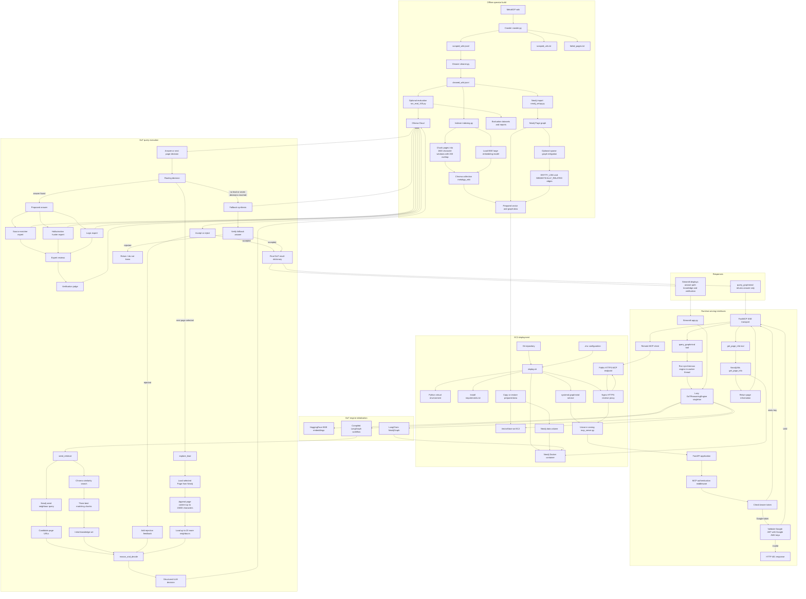
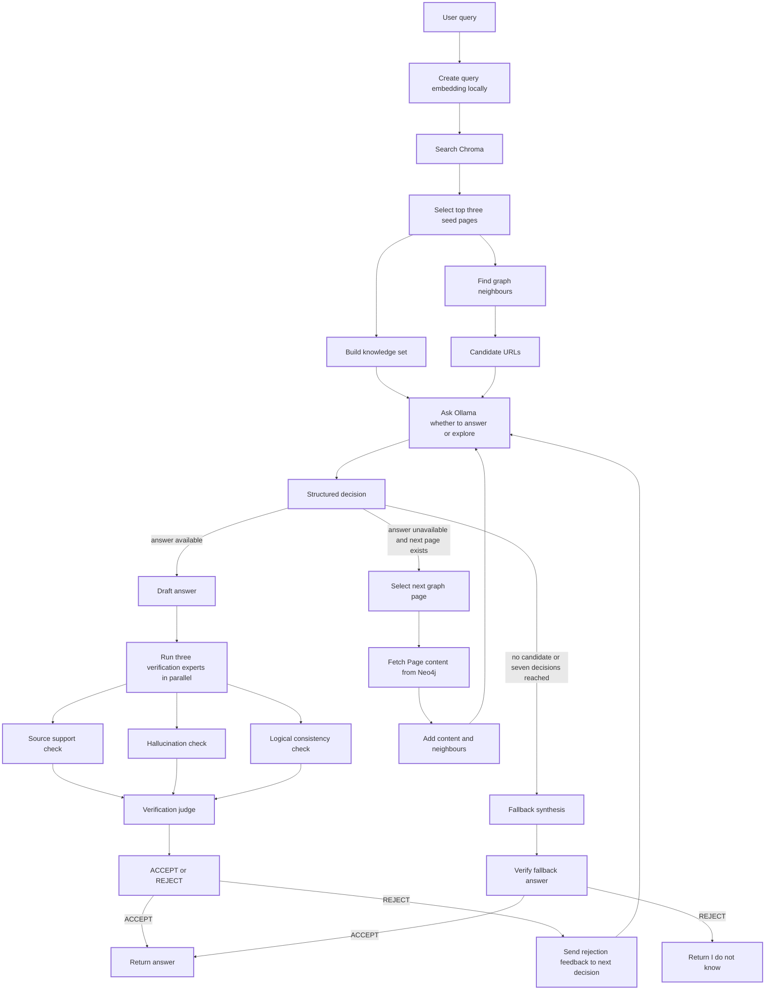

## Full system architecture



## GoT reasoning detail



## Runtime data boundaries

- ChromaDB is local to the EC2 machine.
- Neo4j runs locally in Docker on the EC2 machine.
- Query embeddings are computed locally.
- Ollama Cloud receives the query and retrieved context for reasoning and verification.
- Google is contacted only when Google authentication is used.
- The MCP client receives only the final answer from `query_graphmind`; the internal path and verification details remain inside the application.

## Conversation summary

### What GraphMind is

GraphMind is a corpus-bound Graph RAG system for answering questions about the MetaKGP wiki. It should answer only from the indexed MetaKGP material and return an "I do not know" response when the required information is unavailable.

The main application contract is:

```python
GoTReasoningEngine.reason(query)
```

It returns an answer, visited-page path, collected knowledge, and verification details. The important modules are:

- `Crawler/crawler.py` discovers and scrapes MetaKGP pages.
- `Crawler/cleaner.py` normalizes Markdown and tables.
- `RAG/indexing.py` creates Chroma embeddings.
- `neo4j/neo4j_setup.py` creates the Neo4j page graph.
- `RAG/got_engine.py` performs retrieval, graph traversal, synthesis, and verification.
- `app.py` provides the Streamlit interface.
- `mcp_server.py` provides authenticated MCP tools.
- `run_eval_100.py` evaluates generated questions and answers.

### Offline operator build

The operator builds the knowledge base in this order:

```text
MetaKGP wiki
  -> crawler.py
  -> scraped_wiki.jsonl
  -> cleaner.py
  -> cleaned_wiki.jsonl
```

The cleaned corpus then feeds two independent stores:

```text
cleaned_wiki.jsonl
  -> indexing.py
  -> 1600 character chunks with 200 character overlap
  -> BAAI bge large embeddings
  -> Chroma collection metakgp_wiki

cleaned_wiki.jsonl
  -> neo4j_setup.py
  -> Page nodes and LINKS_TO edges
  -> Neo4j graph
```

The optional `sparse_graph_mitigation.py` command adds fuzzy entity links and semantic links. It is an offline operation and is not part of normal serving. Chroma and Neo4j should be rebuilt or restored from the same cleaned corpus so they remain synchronized.

### EC2 deployment

`deploy.sh` prepares the Ubuntu EC2 machine by installing Python, dependencies, Docker, Nginx, Certbot, and SQLite support. It also:

- creates the Python virtual environment;
- starts Neo4j in Docker on localhost port `7687`;
- copies or restores the local Chroma `VectorStore`;
- enables Chroma SQLite WAL mode;
- creates the `graphmind` systemd service;
- configures Nginx as the public reverse proxy;
- obtains an HTTPS certificate through Certbot and Let’s Encrypt.

Deployment does not crawl or index the wiki automatically. The prepared Chroma store and Neo4j data must already exist or be restored on the server.

### Nginx, SSL, and systemd

Nginx is the public web server and reverse proxy:

```text
MCP client
  -> HTTPS port 443
  -> Nginx
  -> http://127.0.0.1:8000
  -> Uvicorn and FastAPI
  -> FastMCP
```

SSL is the modern TLS protocol. During the TLS handshake, the client validates Nginx’s Let’s Encrypt certificate, both sides perform an ephemeral key exchange, and they derive symmetric session keys. The MCP request is then encrypted between the client and Nginx. Nginx decrypts it and forwards plain HTTP over the EC2 loopback interface to Uvicorn.

systemd is Linux’s service manager. The `graphmind` service starts Uvicorn at boot, loads `.env`, restarts the process if it crashes, and provides status and logs through commands such as:

```bash
sudo systemctl status graphmind
sudo systemctl restart graphmind
sudo journalctl -u graphmind -f
```

### Remote MCP request flow

The client connects to the public MCP SSE endpoint with a bearer credential. Nginx forwards the request to FastAPI. `MCPAuthMiddleware` protects paths beginning with `/mcp`. If authentication succeeds, FastMCP dispatches either `query_graphmind` or `get_page_info`.

`query_graphmind` runs the synchronous reasoning engine in a worker thread, which prevents the blocking LLM and database calls from blocking the async server event loop. The MCP tool returns only `result["answer"]`; it does not currently expose the path, knowledge set, or verification details.

### Internal GoT query flow

For a question, the engine:

1. Computes the query embedding locally using the BGE embedding model.
2. Retrieves three Chroma matches.
3. Adds their page content to the knowledge set.
4. Queries Neo4j for outgoing neighbours and builds candidate URLs.
5. Calls Ollama Cloud for a structured decision: answer now or explore a candidate page.
6. If it explores, it loads the selected Neo4j page, adds up to 15,000 characters, adds more neighbours, and repeats.
7. When an answer is proposed, three verification experts run: source matching, hallucination detection, and logical consistency.
8. A judge accepts or rejects the answer.
9. A rejection sends feedback back into the decision loop; traversal is bounded by seven decisions.
10. If no useful route remains, fallback synthesis is attempted and verified. A rejected fallback becomes "I do not know based on the provided knowledge set."

The LLM calls go to Ollama Cloud. Chroma and Neo4j remain local to the EC2 host.

### Static API key versus Google authentication

The two supported authentication options use the same HTTP header:

```http
Authorization: Bearer <credential>
```

#### Static API key

The server stores:

```env
GRAPHMIND_API_KEY=some-secret-value
```

The client sends that exact value. The middleware compares the strings and accepts the request if they match. This is a shared-secret model: it is simple and useful for trusted scripts or IDEs, but it does not identify an individual user, does not expire automatically, and gives every holder the same access.

#### Google ID token

The Google client ID and client secret are created once in Google Cloud Console and placed in `.env`. They are not created during each login.

The login flow is:

```text
User opens /login
  -> Google authentication
  -> Google redirects to /callback with a temporary authorization code
  -> GraphMind sends the code, client ID, client secret, and redirect URI
     to https://oauth2.googleapis.com/token
  -> Google returns an ID token
  -> The user places the ID token in the MCP client Authorization header
```

The authorization code is a short-lived, single-use exchange value. The ID token is an OpenID Connect JWT containing claims such as `sub`, `email`, `aud`, `iss`, and `exp`. It represents the user; it is not the server’s own identity token. The Google access token may also be returned, but the current project ignores it because GraphMind needs identity rather than access to Google APIs.

### How Google ID-token validation works

For each protected MCP HTTP request, GraphMind extracts the bearer token. If it is not the static API key, it treats it as a possible Google ID token and validates:

- the Google signature;
- the token expiration;
- the audience against `GOOGLE_CLIENT_ID`;
- the issuer against `https://accounts.google.com`.

GraphMind normally performs this verification locally using Google’s cached public JWK signing keys. It contacts Google only when the key cache is missing, older than 24 hours, or the token contains an unknown key ID. It does not perform live Google token introspection for every request.

There is no session cookie in the current design. The MCP client keeps sending the bearer token. When the ID token expires, the user must obtain a new one; refresh-token handling is not implemented.

### What happens when no token is supplied

The current server does not automatically open a Google login prompt for the MCP client. A request without a token receives:

```text
HTTP 401 Unauthorized
Missing or invalid Authorization header
```

The user must manually open `/login`, complete Google authentication, copy the displayed ID token, configure the MCP client, and retry. Automatic prompting would require OAuth discovery metadata and a client-compatible `WWW-Authenticate` challenge, which the current implementation does not provide.

### OAuth state and ID token are different

The OAuth `state` value is a temporary random value used to bind the callback to the original login request and protect against CSRF. The Google ID token is a signed JWT proving the user’s identity. The current implementation uses the ID-token flow but does not generate or validate an OAuth `state` value.

### Current limitations

- Authorization is coarse: any valid static key or valid Google ID token can call both MCP tools.
- There are no roles, scopes, per-user permissions, or resource ownership checks.
- The Google ID token is displayed in the callback HTML page.
- The middleware accepts a token in the URL query string as well as the Authorization header.
- The OAuth callback does not currently use a `state` value.
- The planned custom 30-day GraphMind token is not implemented.
- The existing Chroma store may be out of sync with the current cleaned corpus and should be rebuilt deliberately when ingestion rules change.
- The current unit tests are lightweight and do not exercise live Neo4j, Chroma, Ollama, TLS, or MCP behavior.
